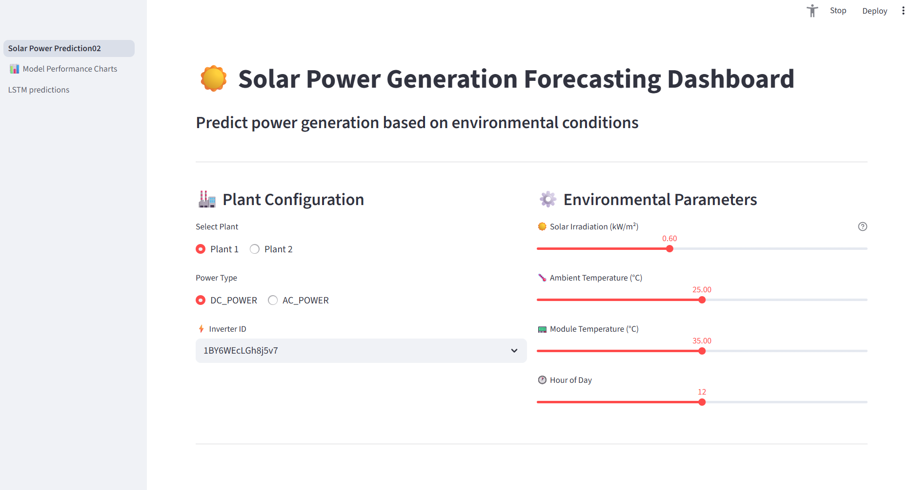
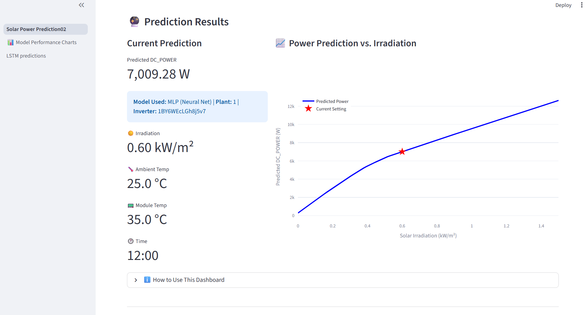
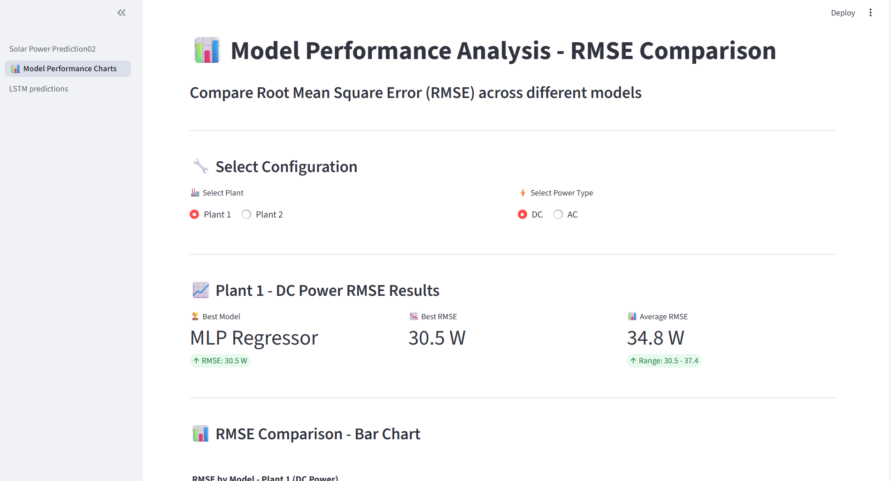
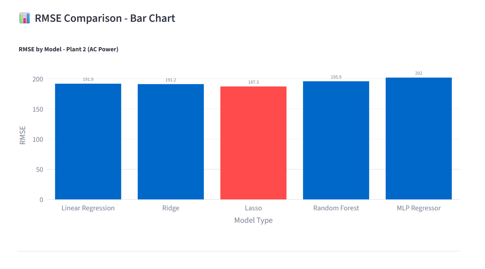
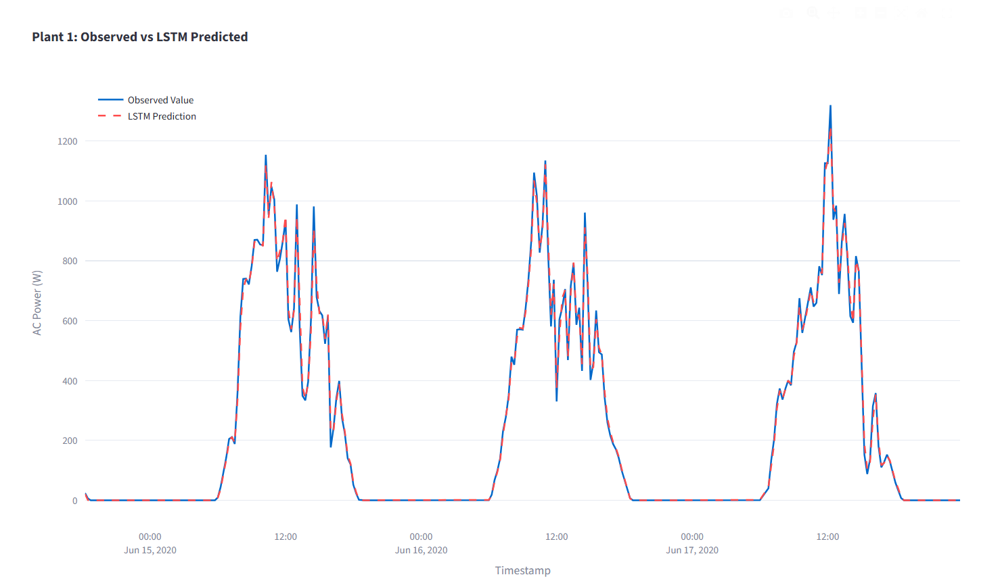
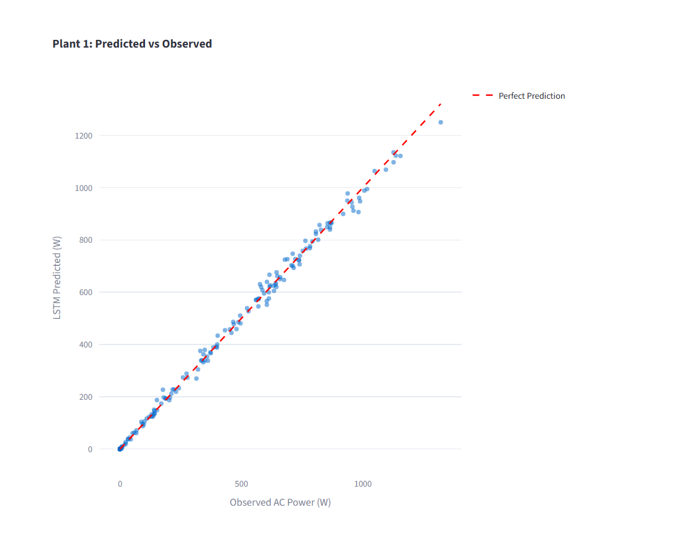

# Solar Power Prediction Dashboard

A Streamlit application for visualizing solar power predictions and model performance across multiple plants.

## Installation

Install Streamlit and required dependencies:

```bash
pip install streamlit
```

Or install all dependencies at once:

```bash
pip install -r requirements.txt
```

## Running the Application

From the project root directory, run:

```bash
streamlit run src/app.py
```

The dashboard will open in your browser at `http://localhost:8501`.

## Features

The application provides three main pages accessible via the sidebar:

1. **Solar Power Prediction** - Compute solar power predictions for Plant 1 and Plant 2 with the trained model in the best performance
2. **Model Performance Charts** - Compare RMSE metrics across different prediction models
3. **LSTM Predictions** - Explore time-series predictions from LSTM models

### Navigation

Use the sidebar to switch between pages. The landing page includes quick links to each section for easy access.

## Design Decisions

**Multi-page architecture**: The started app was limeted to app.py. I want to show multiple page and let user to have more interact with the dashboard.

**Data from pkl and CSV files**: Only LSTM trained model saved as csv file in models folder. Because LSTM model used the previous day or hour data to generate predicted value. Instead of changing parameter, we only show how great our LSTM trained model is. The models in task 3 are used to make the dashboard and user can adjust the parameters to see the predicted value of generated power. 


## Project Structure

```
src/
├── app.py                                  # Main landing page
├── config.py                               # Configuration settings
├── utils.py                                # Helper functions
├── requirements.txt                        # Dependencies
├── models/                                 # CSV data files and pkl files
│   ├── Plant 1_1d_FS_V2_predictions.csv
│   ├── Plant 2_1d_FS_V2_predictions.csv
│   ├──RMSE_Plant.csv
│   ├──plant1_ac_mlp.pkl
│   ├──plant1_dc_mlp_transformed.pkl
│   ├──plant2_ac_lasso.pkl
│   └──plant2_dc_lasso.pkl
└── pages/                                  # Dashboard pages
    ├── 1_Solar_Power_Prediction.py
    ├── 2_Model_Performance_Charts.py
    └── 3_LSTM_predictions.py
```


## Interface screenshot from the dashboard
- 1 Solar panel prediction
In this part, we provide the best model for use to interact. With these models, user can choose the plant and the power  type they want to predict. This page shows the sidebar for user adjust the parameter. It also shows the predict result based the input value.

People can alter parameters including **Temperature**, **Irradiation**, **Hour**. 

The board shows the current parameters and the predicted value.


-2 Model perfomance
Showing the visualized chart for people to understand the perfomance of each model. 



-3 LSTM model
In this page, we shows the predicted result for plant 1 and plant 2. User can see how good is the model and understand the difference between two plants. 
Peoplec can choose power plant that want to see in the beginning of page. The dashboard also shows the performance of the model.



This scatterplots show how great the model is for power prediction in plant 1. The visualize that the observed value or generated power  can't match the desiinged efficiency iin plant 2. This observation called back to our results and conlustion in previous tasks.




## AI statement
I asked AI generating several templates and making example for me understand the functions in streamlit. I redesign the layout with these templates and adjusted the parameters for a better view. I do get through all works and make sure everything is correct. 